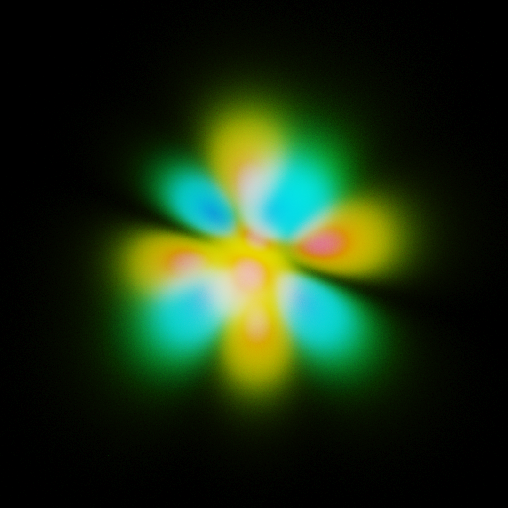
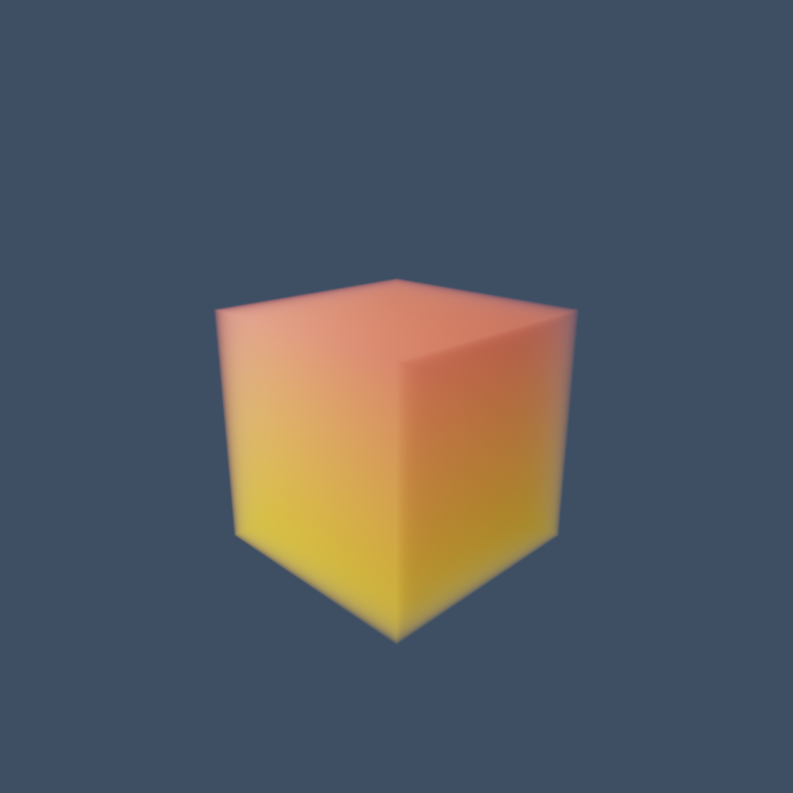

# Aether: Voxel SSS Renderer

Aether 是一个基于物理的高性能体积路径追踪渲染器（Volumetric Path Tracer），完全使用 **Rust** 编写，并利用 **CUDA** 进行 GPU 加速。

该项目专注于渲染非均匀介质（Heterogeneous Media）中的次表面散射（Subsurface Scattering, SSS）效果。它能够生成并渲染复杂的体素数据，例如基于量子力学波函数的氢原子轨道。

## 主要特性

*   **全 GPU 路径追踪**：核心渲染循环完全在 CUDA 上运行。
*   **非均匀介质渲染**：使用 **Delta Tracking (Woodcock Tracking)** 算法精确采样非均匀密度的体素网格。
*   **物理材质系统**：支持逐体素（Per-voxel）的材质属性，包括：
    *   散射反照率 (Albedo)
    *   消光系数 (Sigma_t)
    *   各向异性 (Anisotropy $g$)
    *   折射率 (IOR)
*   **过程式场景生成**：
    *   **Example Cube 场景**：基础的渐变体素立方体测试场景。
    *   **Atom 场景**：基于量子数 ($n, l, m$) 实时计算氢原子波函数密度 $|\psi|^2$，使用 GPU 加速生成体素数据（Laguerre & Legendre 多项式）。
*   **渐进式渲染**：支持实时累积采样，随着时间推移图像质量逐渐提高。
*   **ACES 色调映射**：内置 ACES Film 曲线色调映射和 Gamma 校正。

## 例图

### 1. 原子轨道:

### 2. 基础体积渲染功能：

## 许可证

本项目遵循 [Apache License 2.0](https://www.apache.org/licenses/LICENSE-2.0) 协议。详情请参阅 [LICENSE](LICENSE) 文件。
